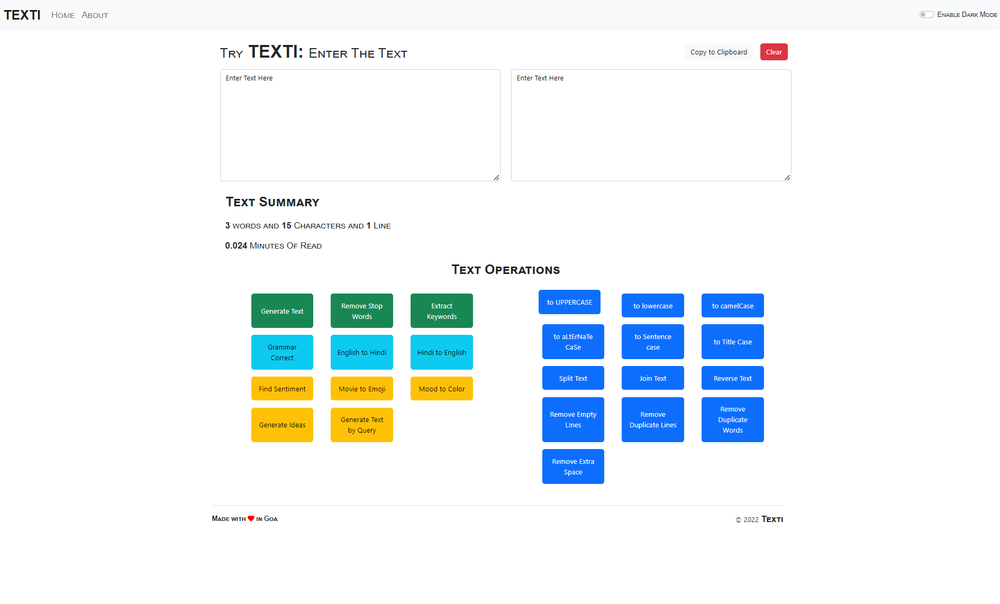

# Introdction
This is a React-based web application hosted on netlify that provides a variety of text manipulation tools for users. The app utilizes functional components and allows users to perform various actions on their text strings, such as converting to uppercase or lowercase, sentence case, alternate case, camel case, removing duplicate lines or words, removing empty lines, splitting or joining strings, removing stopwords, and generating dummy text. The app is designed to be user-friendly and easy to navigate, making it a useful tool for anyone who needs to manipulate text in various ways. Overall, this app can be a powerful tool for writers, editors, and developers who need to manipulate text quickly and efficiently.

## Packeges Used:
   
 
## Website Screenshot:

## You can check the demo at: https://texti.netlify.app/

## Getting Started with Create React App

This project was bootstrapped with [Create React App](https://github.com/facebook/create-react-app).

## In the project directory, you can run:
### `npm install`

### `npm start`
Runs the app in the development mode.
Open [http://localhost:3000](http://localhost:3000) to view it in your browser.

The page will reload when you make changes.\
You may also see any lint errors in the console.

### `npm run build`

Builds the app for production to the `build` folder.\
It correctly bundles React in production mode and optimizes the build for the best performance.

Your app is ready to be deployed!
